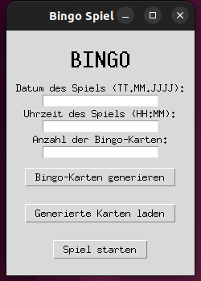
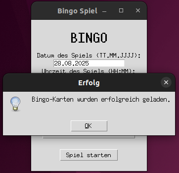

# BingoYolo

BingoYolo ist eine Desktop-Anwendung (Tkinter, Python), mit der du
- Bingo‑Karten mit Datum/Uhrzeit als PDF generierst,
- die generierten Karten lädst und ein Bingo‑Spiel verwaltest,
- gezogene Zahlen komfortabel trackst (Klick oder Eingabe),
- Bingo‑Zustände pro Karte siehst (Reihen/Spalten/Diagonalen),
- optional per Kamera + YOLO Modell Kartennummern/Markierungen erkennst.

## Voraussetzungen
- Python 3.10+ (empfohlen)
- Betriebssystempakete (Linux):
  - `python3-tk` (für Tkinter GUI)
  - Webcam-Treiber, falls Kameraerkennung genutzt wird
- Python-Pakete (siehe `requirements.txt`):
  - `reportlab`, `opencv-python`, `pillow`, `ultralytics`, `numpy`

Hinweis zu YOLO: Lege dein Modell unter `model/m.pt` ab (relativ zum Repo‑Root) oder passe den Pfad in `GUI/gui.py` (`model_path`) an.

## Installation
- Optional: virtuelle Umgebung verwenden
  - `python3 -m venv .venv`
  - `source .venv/bin/activate` (Linux/macOS) bzw. `.venv\Scripts\activate` (Windows)
- Pakete installieren
  - `pip install -r requirements.txt`
- Unter Linux ggf. Tkinter nachinstallieren
  - Debian/Ubuntu: `sudo apt-get install python3-tk`

## Start
- GUI starten: `python GUI/gui.py`
- Standardablage für generierte Artefakte:
  - PDFs/PKLs: `GUI/Bingo_Karten/`
  - YOLO‑Modell (erwartet): `model/m.pt`

## Nutzung
- Karten generieren
  - Datum (TT.MM.JJJJ), Uhrzeit (HH:MM) und Anzahl eingeben
  - „Bingo‑Karten generieren“ erstellt ein PDF und eine `.pkl` mit Kartendaten
- Karten laden
  - „Generierte Karten laden“ → `.pkl` aus `GUI/Bingo_Karten/` wählen
- Spiel starten
  - Zahlenfeld: Zahlen tippen und bestätigen, oder per Klick im Zahlenraster ein/aus schalten
  - „Karte prüfen“ zeigt die Karte im separaten Fenster; markierte Zahlen werden grün
  - Rechte Seite zeigt live die Verteilung „Karten mit X Bingo(s)“
- Kameraerkennung (optional)
  - „Kamera starten“ öffnet ein 1280×720‑Livebild
  - Erwartet ein YOLO‑Modell unter `model/m.pt` und eine funktionierende Webcam
  - Erkennt Klassen (z. B. `Nr.`, Ziffern, `Bingo`, Diagonalen) und vergleicht erkannte Bingo‑Anzahl mit dem tatsächlichen Zustand der geladenen Karte

## Screenshots
Übersicht der wichtigsten Ansichten (kompakt dargestellt). Alle Dateien liegen unter `docs/screenshots/`.

  <!-- Reihe 1 -->
  
  
  

   

  <!-- Reihe 2 -->
  
  
  

   

  <!-- Reihe 3 -->
  

## Troubleshooting
- Kein GUI/ImportError „tkinter“
  - Installiere `python3-tk` (Linux) bzw. nutze eine Python‑Distribution mit Tkinter
- Kamera startet nicht / „Fehler beim Zugriff auf die Webcam“
  - Prüfe, ob eine Webcam verfügbar ist und nicht von einer anderen App belegt wird
  - Rechte unter macOS/Windows/Linux prüfen
- YOLO Modell nicht gefunden
  - Lege die Datei unter `model/m.pt` ab oder passe in `GUI/gui.py` den Pfad (`model_path`) an
- Fehlende Python‑Pakete
  - `pip install -r requirements.txt`

## Entwicklung / Struktur
- `GUI/gui.py`: Tkinter‑Anwendung (Kartenworkflow, Spiel, Kameraerkennung)
- `GUI/Bingo_Karten/`: Ausgabe von generierten PDFs und Kartendaten (`.pkl`)
- `Yolo/`: Trainings/Experiment‑Artefakte, Notebooks, Gewichte
- `model/`: Erwarteter Ort für das zur GUI gehörige Erkennungsmodell `m.pt`

## Roadmap‑Ideen (optional)
- Konfigurierbarer Modellpfad (GUI‑Einstellung statt Hardcode)
- Export‑Button für GUI‑Screenshots aus der App heraus
- Portable Build (PyInstaller)

 
